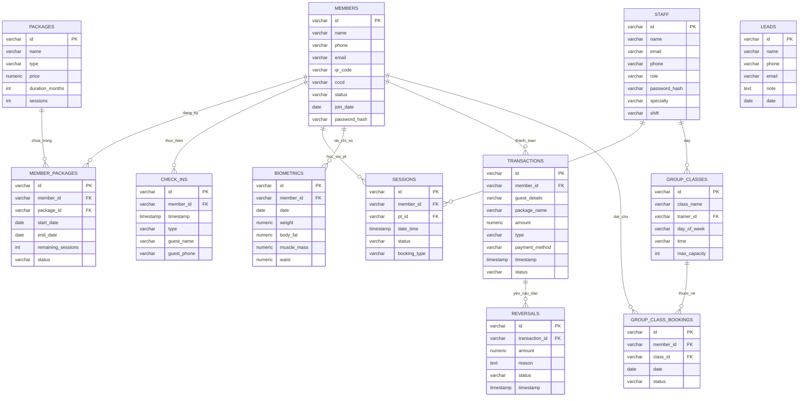

# BÁO CÁO PHÂN TÍCH VÀ THIẾT KẾ CƠ SỞ DỮ LIỆU
## HỆ THỐNG QUẢN LÝ PHÒNG GYM (GYM MANAGEMENT SYSTEM - GMS)

---

## 1. TỔNG QUAN HỆ THỐNG

### 1.1 Mô Tả Chung
Hệ thống Quản lý Phòng Gym (Gym GMS) là giải pháp phần mềm hỗ trợ quản trị và vận hành toàn diện một trung tâm thể hình hiện đại. Hệ thống giải quyết các bài toán nghiệp vụ từ quản lý nhân sự, thông tin hội viên, đăng ký các gói dịch vụ tập luyện, ghi nhận điểm danh (check-in) tự động/thủ công, quản lý lịch tập với Huấn luyện viên cá nhân (PT), đặt chỗ các lớp học nhóm (Yoga, Zumba...), đến theo dõi giao dịch tài chính và xử lý yêu cầu hoàn tiền (đảo giao dịch).

### 1.2 Stack Công Nghệ Hiện Tại
Dự án hiện đang ở giai đoạn **phát triển Frontend** với:
- **Frontend Framework**: React 19.2.6 + Vite 8.0.12
- **Database Solution**: Mock Database (localStorage) - Mục đích phát triển & testing
- **Lưu Trữ**: Browser localStorage (tự động khởi tạo và đồng bộ dữ liệu)
- **Phiên Bản DB**: DB_VERSION = 5 (tự động reset khi cấu trúc thay đổi)

**Ghi chú**: Khi chuyển sang Production, hệ thống sẽ kết nối với backend (Node.js/Express/PostgreSQL) thông qua API RESTful.

---

## 2. CẤU TRÚC DỮ LIỆU VÀ BẢNG (COLLECTIONS)

Do hiện tại sử dụng Mock Database (localStorage), dữ liệu được tổ chức thành các object collection:

| Collection | Số Bản Ghi | Mô Tả |
| :--- | :--- | :--- |
| `members` | 9 | Danh sách hội viên phòng gym |
| `packages` | 8 | Danh mục gói dịch vụ tập luyện |
| `staff` | 3 | Nhân viên (Lễ tân, Admin) |
| `pts` (Trainers) | 2 | Huấn luyện viên cá nhân (PT) |
| `member_packages` | 11 | Thông tin đăng ký gói dịch vụ của hội viên |
| `check_ins` | 11 | Lịch sử check-in vào phòng tập |
| `sessions` | 15 | Buổi tập với PT cá nhân |
| `biometrics` | 12 | Chỉ số sinh trắc học của hội viên |
| `transactions` | 11 | Giao dịch thanh toán |
| `reversals` | 0 | Yêu cầu hoàn giao dịch (trống) |
| `group_classes` | 3 | Lớp học nhóm (Yoga, Zumba, v.v.) |
| `group_class_bookings` | 5 | Đặt chỗ tham gia lớp học nhóm |
| `leads` | 3 | Khách hàng tiềm năng |
| `schedule_requests` | 2 | Yêu cầu lịch tập cố định với PT |

---

## 3. MÔ HÌNH THỰC THỂ - LIÊN KẾT (ERD)

Dưới đây là sơ đồ thực thể liên kết (Entity-Relationship Diagram) biểu diễn các thực thể chính trong hệ thống Gym GMS và các mối quan hệ giữa chúng. Sơ đồ được xây dựng bằng công cụ Mermaid:



---

## 3. MÔ HÌNH DỮ LIỆU QUAN HỆ (RELATIONAL SCHEMA)

Mô hình dữ liệu quan hệ được ánh xạ từ sơ đồ ERD, chuẩn hóa ở dạng chuẩn 3 (3NF) để tránh trùng lặp dữ liệu và bất thường khi thêm/sửa/xóa. Các khóa chính được **in đậm**, các khóa ngoại được *in nghiêng*.

1. **MEMBERS** (**id**, name, phone, email, qr_code, cccd, status, join_date, password_hash)
2. **PACKAGES** (**id**, name, type, price, duration_months, sessions)
3. **STAFF** (**id**, name, email, phone, role, password_hash, specialty, shift)
4. **MEMBER_PACKAGES** (**id**, *member_id*, *package_id*, start_date, end_date, remaining_sessions, status)
5. **CHECK_INS** (**id**, *member_id*, timestamp, type, guest_name, guest_phone)
6. **SESSIONS** (**id**, *member_id*, *pt_id*, date_time, status, booking_type)
7. **BIOMETRICS** (**id**, *member_id*, date, weight, body_fat, muscle_mass, waist)
8. **TRANSACTIONS** (**id**, *member_id*, guest_details, package_name, amount, type, payment_method, timestamp, status)
9. **REVERSALS** (**id**, *transaction_id*, amount, reason, status, timestamp)
10. **GROUP_CLASSES** (**id**, class_name, *trainer_id*, day_of_week, time, max_capacity)
11. **GROUP_CLASS_BOOKINGS** (**id**, *member_id*, *class_id*, date, status)
12. **LEADS** (**id**, name, phone, email, note, date)


---

## 4. TỪ ĐIỂN DỮ LIỆU (DATA DICTIONARY)

Dưới đây là mô tả chi tiết kiểu dữ liệu, ràng buộc và mục đích của các thuộc tính trong từng bảng CSDL:

### 4.1 Bảng `members` (Hội viên phòng tập)
| Thuộc tính | Kiểu dữ liệu | Ràng buộc | Mô tả ý nghĩa |
| :--- | :--- | :--- | :--- |
| `id` | VARCHAR(20) | PRIMARY KEY | Mã số hội viên độc nhất (ví dụ: 'MB-001') |
| `name` | VARCHAR(100) | NOT NULL | Họ và tên của hội viên |
| `phone` | VARCHAR(15) | UNIQUE, NOT NULL | Số điện thoại di động dùng để liên lạc/tìm kiếm |
| `email` | VARCHAR(100) | UNIQUE, NULL | Địa chỉ thư điện tử |
| `qr_code` | VARCHAR(50) | UNIQUE, NOT NULL | Chuỗi mã hóa QR dùng để check-in quét thẻ tự động |
| `cccd` | VARCHAR(12) | UNIQUE, NOT NULL | Số Căn cước công dân của hội viên |
| `status` | VARCHAR(20) | CHECK (in: 'active', 'expired', 'cancelled') | Trạng thái thẻ hội viên |
| `join_date` | DATE | DEFAULT CURRENT_DATE | Ngày đầu tiên đăng ký tham gia phòng gym |
| `password_hash`| VARCHAR(255) | NOT NULL | Mật khẩu tài khoản đã được băm mã hóa |

### 4.2 Bảng `packages` (Danh mục gói dịch vụ)
| Thuộc tính | Kiểu dữ liệu | Ràng buộc | Mô tả ý nghĩa |
| :--- | :--- | :--- | :--- |
| `id` | VARCHAR(20) | PRIMARY KEY | Mã gói tập (ví dụ: 'PKG-001', 'PKG-PT10') |
| `name` | VARCHAR(100) | NOT NULL | Tên hiển thị của gói tập |
| `type` | VARCHAR(20) | CHECK (in: 'classic', 'pt', 'class', 'swimming') | Phân loại hình thức gói tập |
| `price` | NUMERIC(12, 2)| CHECK (>= 0), NOT NULL | Giá bán niêm yết của gói dịch vụ |
| `duration_months`| INT | CHECK (> 0), NOT NULL | Thời hạn sử dụng tính theo tháng |
| `sessions` | INT | NULL hoặc > 0 | Số buổi tập huấn luyện viên cá nhân (chỉ có ở loại 'pt') |

### 4.3 Bảng `staff` (Nhân sự & Huấn luyện viên)
*Lưu ý: Hợp nhất nhân viên và PT để chuẩn hóa định danh.*
| Thuộc tính | Kiểu dữ liệu | Ràng buộc | Mô tả ý nghĩa |
| :--- | :--- | :--- | :--- |
| `id` | VARCHAR(20) | PRIMARY KEY | Mã nhân viên (ví dụ: 'AD-001', 'ST-001', 'PT-001') |
| `name` | VARCHAR(100) | NOT NULL | Họ và tên nhân viên |
| `email` | VARCHAR(100) | UNIQUE, NOT NULL | Email nội bộ liên hệ |
| `phone` | VARCHAR(15) | UNIQUE, NOT NULL | Số điện thoại liên hệ |
| `role` | VARCHAR(20) | CHECK (in: 'admin', 'receptionist', 'pt') | Vai trò chức vụ trong hệ thống |
| `password_hash`| VARCHAR(255) | NOT NULL | Mật khẩu đăng nhập đã băm |
| `specialty` | VARCHAR(200) | NULL | Chuyên môn huấn luyện (chỉ điền nếu role = 'pt') |
| `shift` | VARCHAR(100) | NOT NULL | Ca trực mặc định được phân bổ |

### 4.4 Bảng `member_packages` (Thông tin đăng ký dịch vụ của hội viên)
| Thuộc tính | Kiểu dữ liệu | Ràng buộc | Mô tả ý nghĩa |
| :--- | :--- | :--- | :--- |
| `id` | VARCHAR(20) | PRIMARY KEY | Mã lượt đăng ký dịch vụ (ví dụ: 'MP-001') |
| `member_id` | VARCHAR(20) | FOREIGN KEY -> members(id) | Mã hội viên đăng ký mua gói |
| `package_id` | VARCHAR(20) | FOREIGN KEY -> packages(id) | Gói tập được chọn mua |
| `start_date` | DATE | NOT NULL | Ngày kích hoạt gói tập |
| `end_date` | DATE | NOT NULL | Ngày hết hạn gói tập |
| `remaining_sessions`| INT | NULL hoặc >= 0 | Số buổi tập PT còn lại (dành cho gói PT) |
| `status` | VARCHAR(20) | CHECK (in: 'active', 'expired', 'cancelled') | Trạng thái sử dụng của gói này |

### 4.5 Bảng `check_ins` (Nhật ký điểm danh vào phòng tập)
| Thuộc tính | Kiểu dữ liệu | Ràng buộc | Mô tả ý nghĩa |
| :--- | :--- | :--- | :--- |
| `id` | VARCHAR(20) | PRIMARY KEY | Mã check-in (ví dụ: 'CI-001') |
| `member_id` | VARCHAR(20) | FOREIGN KEY -> members(id), NULLABLE | ID hội viên check-in (NULL nếu là khách vãng lai) |
| `timestamp` | TIMESTAMPTZ | NOT NULL | Thời gian chính xác thực hiện quét thẻ vào |
| `type` | VARCHAR(20) | CHECK (in: 'auto', 'manual', 'dropin') | Hình thức điểm danh |
| `guest_name` | VARCHAR(100) | NULL | Tên khách lẻ (nếu type = 'dropin') |
| `guest_phone` | VARCHAR(15) | NULL | Số điện thoại khách lẻ (nếu type = 'dropin') |

### 4.6 Bảng `sessions` (Lịch đặt tập PT cá nhân)
| Thuộc tính | Kiểu dữ liệu | Ràng buộc | Mô tả ý nghĩa |
| :--- | :--- | :--- | :--- |
| `id` | VARCHAR(20) | PRIMARY KEY | Mã lịch tập cá nhân (ví dụ: 'SS-001') |
| `member_id` | VARCHAR(20) | FOREIGN KEY -> members(id) | Hội viên đặt lịch |
| `pt_id` | VARCHAR(20) | FOREIGN KEY -> staff(id) | Huấn luyện viên được đặt lịch (phải có role = 'pt') |
| `date_time` | TIMESTAMP | NOT NULL | Thời gian bắt đầu buổi tập |
| `status` | VARCHAR(20) | CHECK (in: 'pending', 'confirmed', 'completed', 'cancelled') | Trạng thái buổi tập |
| `booking_type` | VARCHAR(20) | CHECK (in: 'ondemand', 'schedule') | Loại đặt lịch (yêu cầu đột xuất / định kỳ) |

### 4.7 Bảng `biometrics` (Lịch sử chỉ số sinh trắc học hội viên)
| Thuộc tính | Kiểu dữ liệu | Ràng buộc | Mô tả ý nghĩa |
| :--- | :--- | :--- | :--- |
| `id` | VARCHAR(20) | PRIMARY KEY | Mã bản ghi sinh trắc học |
| `member_id` | VARCHAR(20) | FOREIGN KEY -> members(id) | Mã hội viên được đo chỉ số |
| `date` | DATE | NOT NULL | Ngày thực hiện đo đạc chỉ số cơ thể |
| `weight` | NUMERIC(5,2) | CHECK (> 0), NOT NULL | Cân nặng (kg) |
| `body_fat` | NUMERIC(4,1) | CHECK (0 đến 100), NULLABLE | Tỷ lệ phần trăm mỡ cơ thể (%) |
| `muscle_mass` | NUMERIC(5,2) | CHECK (>= 0), NULLABLE | Khối lượng cơ nạc (kg) |
| `waist` | NUMERIC(5,2) | CHECK (>= 0), NULLABLE | Số đo vòng eo (cm) |

### 4.8 Bảng `transactions` (Giao dịch thanh toán hóa đơn)
| Thuộc tính | Kiểu dữ liệu | Ràng buộc | Mô tả ý nghĩa |
| :--- | :--- | :--- | :--- |
| `id` | VARCHAR(20) | PRIMARY KEY | Mã giao dịch tài chính (ví dụ: 'TX-001') |
| `member_id` | VARCHAR(20) | FOREIGN KEY -> members(id), NULLABLE | Hội viên thanh toán (NULL nếu là khách lẻ) |
| `guest_details`| VARCHAR(200) | NULLABLE | Mô tả thông tin khách vãng lai nếu không phải hội viên |
| `package_name` | VARCHAR(100) | NOT NULL | Tên gói dịch vụ mua tại thời điểm giao dịch |
| `amount` | NUMERIC(12,2)| CHECK (>= 0), NOT NULL | Số tiền thanh toán thực tế |
| `type` | VARCHAR(20) | CHECK (in: 'sale', 'dropin') | Loại hình giao dịch |
| `payment_method`| VARCHAR(20) | CHECK (in: 'banking', 'cash', 'card') | Phương thức thanh toán (chuyển khoản, tiền mặt, thẻ) |
| `timestamp` | TIMESTAMPTZ | NOT NULL | Thời điểm hoàn thành giao dịch |
| `status` | VARCHAR(20) | CHECK (in: 'completed', 'reversed') | Trạng thái giao dịch (Hoàn thành / Đã bị đảo ngược) |

### 4.9 Bảng `reversals` (Yêu cầu đảo/hoàn tác giao dịch tài chính)
| Thuộc tính | Kiểu dữ liệu | Ràng buộc | Mô tả ý nghĩa |
| :--- | :--- | :--- | :--- |
| `id` | VARCHAR(20) | PRIMARY KEY | Mã yêu cầu hoàn trả (ví dụ: 'RV-001') |
| `transaction_id`| VARCHAR(20) | FOREIGN KEY -> transactions(id) | Mã giao dịch gốc cần hoàn tác |
| `amount` | NUMERIC(12,2)| CHECK (>= 0), NOT NULL | Số tiền yêu cầu hoàn trả |
| `reason` | TEXT | NOT NULL | Lý do hoàn trả giao dịch |
| `status` | VARCHAR(20) | CHECK (in: 'pending', 'approved', 'rejected') | Trạng thái phê duyệt của Admin |
| `timestamp` | TIMESTAMPTZ | NOT NULL | Thời điểm tạo yêu cầu hoàn trả |

### 4.10 Bảng `group_classes` (Thời khóa biểu lớp học nhóm)
| Thuộc tính | Kiểu dữ liệu | Ràng buộc | Mô tả ý nghĩa |
| :--- | :--- | :--- | :--- |
| `id` | VARCHAR(20) | PRIMARY KEY | Mã lớp học nhóm (ví dụ: 'GC-001') |
| `class_name` | VARCHAR(100) | NOT NULL | Tên lớp học (ví dụ: 'Lớp Yoga Trị Liệu') |
| `trainer_id` | VARCHAR(20) | FOREIGN KEY -> staff(id) | Huấn luyện viên giảng dạy lớp (phải có role = 'pt') |
| `day_of_week` | VARCHAR(20) | NOT NULL | Thứ trong tuần diễn ra lớp học (ví dụ: 'Thứ 2') |
| `time` | VARCHAR(50) | NOT NULL | Giờ học cố định (ví dụ: '18:00 - 19:30') |
| `max_capacity` | INT | CHECK (> 0), NOT NULL | Sức chứa học viên tối đa của lớp học |

### 4.11 Bảng `group_class_bookings` (Lịch đăng ký tham gia lớp học nhóm của hội viên)
| Thuộc tính | Kiểu dữ liệu | Ràng buộc | Mô tả ý nghĩa |
| :--- | :--- | :--- | :--- |
| `id` | VARCHAR(20) | PRIMARY KEY | Mã đặt chỗ (ví dụ: 'GB-001') |
| `member_id` | VARCHAR(20) | FOREIGN KEY -> members(id) | Mã hội viên đặt chỗ |
| `class_id` | VARCHAR(20) | FOREIGN KEY -> group_classes(id) | Lớp học được chọn |
| `date` | DATE | NOT NULL | Ngày cụ thể đi học |
| `status` | VARCHAR(20) | CHECK (in: 'booked', 'attended', 'cancelled') | Trạng thái buổi học (Đã đặt, Đã tham gia, Đã hủy) |

### 4.12 Bảng `leads` (Thông tin khách hàng tiềm năng)
| Thuộc tính | Kiểu dữ liệu | Ràng buộc | Mô tả ý nghĩa |
| :--- | :--- | :--- | :--- |
| `id` | VARCHAR(20) | PRIMARY KEY | Mã nguồn khách hàng tiềm năng (ví dụ: 'LD-001') |
| `name` | VARCHAR(100) | NOT NULL | Họ và tên của khách hàng tiềm năng |
| `phone` | VARCHAR(15) | NOT NULL | Số điện thoại liên hệ |
| `email` | VARCHAR(100) | NULL | Địa chỉ email liên hệ |
| `note` | TEXT | NULL | Ghi chú nhu cầu tư vấn (ví dụ: 'Quan tâm gói 12 tháng') |
| `date` | DATE | DEFAULT CURRENT_DATE | Ngày tiếp nhận thông tin khách hàng |

---


## 5. RÀNG BUỘC TOÀN VẸN (INTEGRITY CONSTRAINTS)

Để bảo đảm cơ sở dữ liệu không bị sai lệch dữ liệu do các lỗi nghiệp vụ hoặc nhập liệu sai, các ràng buộc toàn vẹn được thiết kế trực tiếp trong cấu trúc database:

1. **Ràng buộc Thực thể (Entity Integrity):** Tất cả các bảng đều có khóa chính (`PRIMARY KEY`) không trùng lặp và không được nhận giá trị `NULL`.
2. **Ràng buộc Tham chiếu (Referential Integrity):** Khóa ngoại kiểm soát mối quan hệ chặt chẽ giữa các thực thể:
   * Xóa một Hội viên (`members`) sẽ tự động xóa chỉ số cơ thể (`biometrics`), lịch quét thẻ (`check_ins`) và lịch đăng ký lớp học nhóm (`group_class_bookings`) thông qua cơ chế `ON DELETE CASCADE`.
   * Đối với giao dịch tài chính (`transactions`), khi xóa hội viên thì thông tin giao dịch vẫn được lưu giữ lại bằng cách đặt trường `member_id = NULL` thông qua cơ chế `ON DELETE SET NULL`.
   * Gói dịch vụ (`packages`) đang có hội viên đăng ký không thể bị xóa do sử dụng ràng buộc `ON DELETE RESTRICT` để đảm bảo quyền lợi hội viên.
3. **Ràng buộc Nghiệp vụ cốt lõi (Business / Semantic Constraints):**
   * **Ngày hiệu lực gói tập:** `end_date >= start_date` trong bảng `member_packages`.
   * **Số buổi PT còn lại:** Trường `remaining_sessions` phải `>= 0` (được đảm bảo bằng ràng buộc `CHECK (remaining_sessions >= 0 OR remaining_sessions IS NULL)`).
   * **Giới hạn tham gia lớp học nhóm:** Một hội viên chỉ được đặt chỗ một lớp học nhất định trong một ngày duy nhất. Điều này được cấu hình bằng khóa phức hợp duy nhất: `CONSTRAINT unique_member_class_date UNIQUE (member_id, class_id, date)`.
   * **Chỉ số sinh trắc hợp lệ:** Cân nặng `weight > 0` và tỷ lệ mỡ cơ thể `0 <= body_fat <= 100` (đảm bảo tính thực tế y học).

---

## 6. CÁC CÂU TRUY VẤN SQL GIẢI QUYẾT NGHIỆP VỤ (BUSINESS QUERIES)

Dưới đây là một số câu lệnh SQL nâng cao được áp dụng để giải quyết các nghiệp vụ thực tế trên giao diện hệ thống:

### Query 6.1: Thống kê doanh thu thực tế phân bổ theo loại gói tập (Báo cáo Admin)
*Nghiệp vụ: Phục vụ biểu đồ tài chính trong Admin Dashboard. Chỉ tính các giao dịch thành công (status = 'completed') và loại bỏ giao dịch đã bị đảo ngược.*
```sql
SELECT 
    CASE 
        WHEN p.type = 'classic' THEN 'Gói Tập Thường'
        WHEN p.type = 'pt' THEN 'Gói Huấn Luyện PT'
        WHEN p.type = 'class' OR p.type = 'swimming' THEN 'Gói Lớp Học/Hồ Bơi'
        ELSE 'Khách Vãng Lai (Drop-in)'
    END AS loai_san_pham,
    SUM(t.amount) AS tong_doanh_thu,
    COUNT(t.id) AS so_luong_giao_dich
FROM transactions t
LEFT JOIN member_packages mp ON t.member_id = mp.member_id 
    AND t.package_name LIKE '%' || (SELECT name FROM packages WHERE id = mp.package_id) || '%'
LEFT JOIN packages p ON mp.package_id = p.id
WHERE t.status = 'completed'
GROUP BY loai_san_pham
ORDER BY tong_doanh_thu DESC;
```

### Query 6.2: Kiểm tra tính hợp lệ của thẻ khi hội viên check-in (Quét mã QR)
*Nghiệp vụ: Khi quét mã QR có dạng `QR_MB_001`, hệ thống kiểm tra xem hội viên đó có gói tập nào đang hoạt động (status = 'active') và còn thời hạn hay không.*
```sql
SELECT 
    m.id AS member_id, 
    m.name AS member_name, 
    m.status AS member_status,
    mp.id AS active_package_id, 
    p.name AS package_name, 
    mp.end_date,
    CASE 
        WHEN mp.end_date >= CURRENT_DATE AND m.status = 'active' THEN 'Hợp lệ - Cho phép vào'
        ELSE 'Không hợp lệ - Từ chối vào'
    END AS ket_qua_checkin
FROM members m
JOIN member_packages mp ON m.id = mp.member_id
JOIN packages p ON mp.package_id = p.id
WHERE m.qr_code = 'QR_MB_001' AND mp.status = 'active'
ORDER BY mp.end_date DESC
LIMIT 1;
```

### Query 6.3: Ma trận phân ca trực hàng tuần của Nhân sự (Báo cáo Admin)
*Nghiệp vụ: Hiển thị danh sách nhân sự (Lễ tân và PT) phân bổ theo từng ca làm việc để quản lý vận hành.*
```sql
SELECT 
    shift AS ca_lam_viec,
    role AS chuc_vu,
    STRING_AGG(name || ' (' || id || ')', ', ') AS danh_sach_nhan_su,
    COUNT(id) AS so_luong
FROM staff
GROUP BY shift, role
ORDER BY ca_lam_viec, role;
```

### Query 6.4: Truy xuất lịch sử biến động cân nặng & mỡ của hội viên (Báo cáo Tiến trình Sức khỏe)
*Nghiệp vụ: Lấy lịch sử sinh trắc học của hội viên `MB-001` sắp xếp theo thời gian tăng dần để vẽ biểu đồ tiến trình trên Member Dashboard.*
```sql
SELECT 
    date AS ngay_do,
    weight AS can_nang_kg,
    body_fat AS ty_le_mo_pct,
    muscle_mass AS khoi_luong_co_kg,
    waist AS vong_eo_cm,
    ROUND((weight - LAG(weight, 1) OVER (ORDER BY date))::numeric, 2) AS bien_dong_can_nang
FROM biometrics
WHERE member_id = 'MB-001'
ORDER BY date ASC;
```

### Query 6.5: Kiểm tra số chỗ còn trống trong lớp học nhóm ngày `2026-06-15`
*Nghiệp vụ: Khi hội viên nhấn đăng ký lớp học, hệ thống cần tính toán số học viên đã đăng ký thực tế để so sánh với sức chứa tối đa (`max_capacity`).*
```sql
SELECT 
    gc.id AS class_id,
    gc.class_name,
    s.name AS trainer_name,
    gc.time AS gio_hoc,
    gc.max_capacity AS suc_chua_toi_da,
    COUNT(gcb.id) AS so_cho_da_dat,
    (gc.max_capacity - COUNT(gcb.id)) AS so_cho_con_trong
FROM group_classes gc
JOIN staff s ON gc.trainer_id = s.id
LEFT JOIN group_class_bookings gcb ON gc.id = gcb.class_id AND gcb.date = '2026-06-15'
GROUP BY gc.id, gc.class_name, s.name, gc.time, gc.max_capacity;
```

### Query 6.6: Liệt kê danh sách các yêu cầu đảo giao dịch đang chờ duyệt (Báo cáo Admin)
*Nghiệp vụ: Lấy các yêu cầu đảo giao dịch kèm thông tin chi tiết về người mua, số tiền và lý do để Admin duyệt trong Admin Dashboard.*
```sql
SELECT 
    r.id AS reversal_id,
    r.transaction_id,
    COALESCE(m.name, t.guest_details) AS nguoi_mua,
    t.package_name AS ten_goi_tap,
    r.amount AS so_tien_hoan,
    r.reason AS ly_do_hoan,
    r.timestamp AS thoi_gian_yeu_cau
FROM reversals r
JOIN transactions t ON r.transaction_id = t.id
LEFT JOIN members m ON t.member_id = m.id
WHERE r.status = 'pending'
ORDER BY r.timestamp DESC;
```
